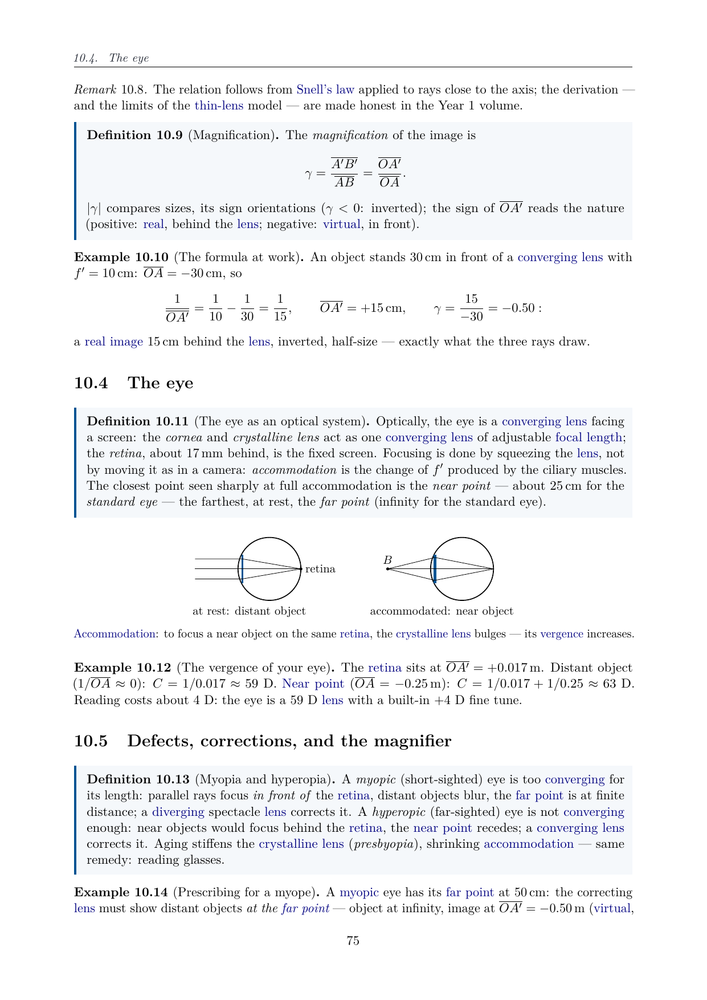
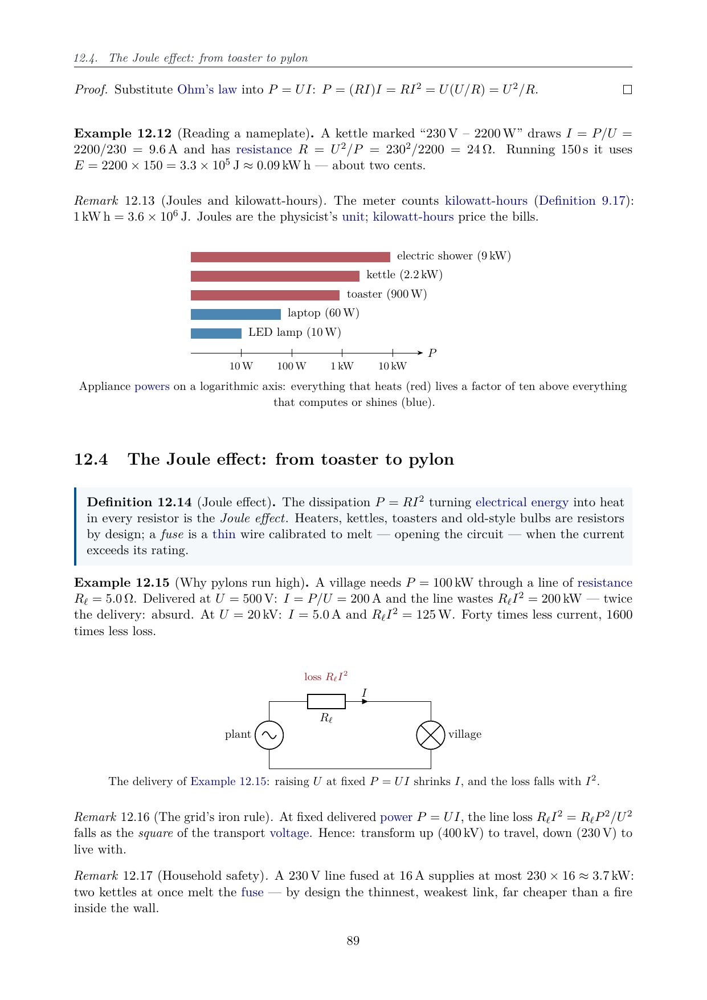
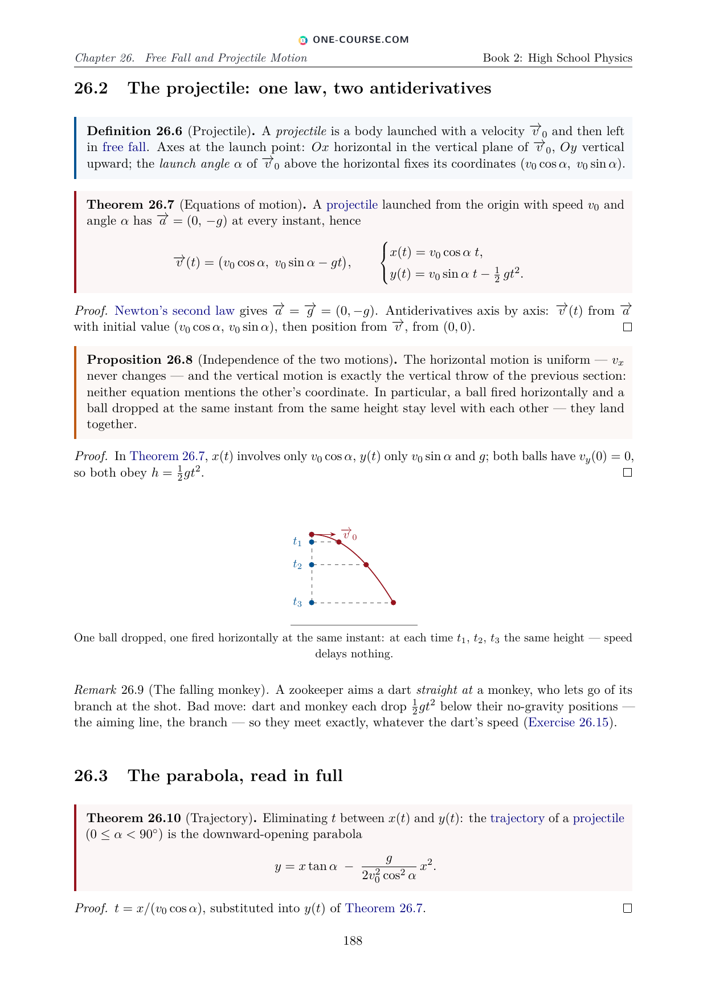

# One Physics Book

<p align="center">
  <a href="https://www.one-course.com">
    
  </a>
</p>

<p align="center">
  <a href="https://github.com/bvirrion/one-physics-book/releases/latest"></a>
  <a href="https://github.com/bvirrion/one-physics-book/releases"></a>
  <a href="https://github.com/bvirrion/one-physics-book/actions/workflows/release.yml"></a>
  <a href="https://www.one-course.com/books"></a>
</p>

*The One Physics Book to Rule Them All.*

> **One Physics Book** is part of the **One Course** project — one coherent
> course covering each subject from kindergarten to the end of the
> bachelor's degree. Discover the whole project at
> **[www.one-course.com](https://www.one-course.com)**, and see the sibling
> [One Math Book](https://github.com/bvirrion/one-math-book).

A series of five **free physics textbooks** with the ambition of forming a
single coherent course **from Grade 1 to the end of the bachelor's
degree** — one notation, one voice, every year building on the previous
one. The **High School book is complete today**, in six editions:
**English, French, Dutch, Spanish, Portuguese and Hindi** — free to
download for students, parents, teachers and homeschooling families:

1. **Primary & Middle School Physics** — Grades 1–9;
2. **High School Physics** — Grades 10–12;
3. **University Physics — Year 1**;
4. **University Physics — Year 2**;
5. **University Physics — Year 3**.

The contents follow the old French physics programs: the physics parts of
the collège and lycée « S » (scientifique) track for the school years, the
PCSI and PC\* classes préparatoires for the first two university years, and
a Licence 3 de physique for the third. Unlike those programs, this course
is **physics only** (no chemistry), and the early grades — where French
schools taught no physics — are covered by age-adapted chapters so that the
course truly starts in Grade 1.

The style is concise and rigorous: courses built from **definitions,
examples, propositions, theorems and methods**, with derivations whenever
they are accessible at the given level (results admitted without proof are
explicitly marked), followed by graded **exercises with full solutions**
collected at the end of each book. Thousands of generated hyperlinks send
every defined term back to its definition, and every exercise to its
solution.

<p align="center">
  
  
  
</p>
<p align="center"><sub>Three pages from Book 2 (High School): optics of the eye, the Joule effect, projectile motion.</sub></p>

## Download the PDFs

| Book | Download PDF |
|------|--------------|
| **2. High School** (Grades 10–12) — complete | [EN](https://github.com/bvirrion/one-physics-book/releases/latest/download/one_physics_book_2_high_school.pdf) · [ES](https://github.com/bvirrion/one-physics-book/releases/latest/download/one_physics_book_2_high_school_es.pdf) · [FR](https://github.com/bvirrion/one-physics-book/releases/latest/download/one_physics_book_2_high_school_fr.pdf) · [HI](https://github.com/bvirrion/one-physics-book/releases/latest/download/one_physics_book_2_high_school_hi.pdf) · [NL](https://github.com/bvirrion/one-physics-book/releases/latest/download/one_physics_book_2_high_school_nl.pdf) · [PT](https://github.com/bvirrion/one-physics-book/releases/latest/download/one_physics_book_2_high_school_pt.pdf) |
| **1. Primary & Middle School** (Grades 1–9) — structural preview | [EN](https://github.com/bvirrion/one-physics-book/releases/latest/download/one_physics_book_1_primary_middle_school.pdf) |
| **3. University — Year 1** — structural preview | [EN](https://github.com/bvirrion/one-physics-book/releases/latest/download/one_physics_book_3_university_year_1.pdf) |
| **4. University — Year 2** — structural preview | [EN](https://github.com/bvirrion/one-physics-book/releases/latest/download/one_physics_book_4_university_year_2.pdf) |
| **5. University — Year 3** — structural preview | [EN](https://github.com/bvirrion/one-physics-book/releases/latest/download/one_physics_book_5_university_year_3.pdf) |

The PDF links always point at the newest release; the online reader at
[one-course.com/books](https://www.one-course.com/books) will carry the
physics books soon. Spotted a mistake? Please
[report an erratum](https://github.com/bvirrion/one-physics-book/issues/new?template=errata.yml) —
fixes usually ship within days.

## Current status

✅ **Book 2 (High School, grades 10–12) is fully written**: 35 chapters
of course text with 130+ TikZ figures, 525 graded exercises, 35 weekend
problems (~20 questions each), full solutions to everything, and 4 500+
defined-term links — about 350 pages, in all six languages (English,
French, Dutch, Spanish, Portuguese, Hindi).

🚧 Books 1 and 3–5 build with every chapter present as a titled
placeholder; their content is being written.

## Building the books

Requirements: a TeX Live installation with `latexmk` (packages used:
`tcolorbox`, `pgfplots`, `amsthm`, `cleveref`, `imakeidx`, …).

```sh
make            # or just: latexmk — builds all books
```

The PDFs are produced at

```
build/one_physics_book_<N>_<slug>[_<lang>].pdf
```

with `N` = 1–5 and, for the High School book, `lang` ∈ {`fr`, `nl`,
`es`, `pt`, `hi`} (no suffix for English) — 10 PDFs in total. The Hindi
edition compiles with XeLaTeX (Devanagari, fonts bundled under
`assets/fonts/`); everything else is pdflatex.

`make clean` removes auxiliary files, `make distclean` removes the whole
`build/` directory. To build a single book, e.g.\
`latexmk one_physics_book_2_high_school.tex`.

## Repository layout

```
one_physics_book_<N>_*.tex   entry file per book / language (N = series number)
styles/onephysics.sty        packages, theorem environments, macros
styles/lang/<lang>.tex       UI strings (en, fr, nl, es, pt, hi)
frontmatter/                 title page, preface (shared layout)
parts/<year>/part.tex        shared structure for a school year
parts/<year>/NN-*.tex        English chapter
parts/<year>/<lang>/NN-*.tex translated chapter (same labels)
parts/<year>/solutions/      English + <lang>/ solutions
```

## Contributing

Contributions are welcome — new chapters and years, corrections, better
derivations, additional exercises, figures. Please read
[CONTRIBUTING.md](CONTRIBUTING.md) for the structure, environments and
style conventions of the project. The fastest way to help is to
[report an erratum](https://github.com/bvirrion/one-physics-book/issues/new?template=errata.yml)
when you spot a mistake.

## Contributors

- Benjamin Virrion
- Fable 5 (Anthropic's Claude)

## License

Not yet decided.
